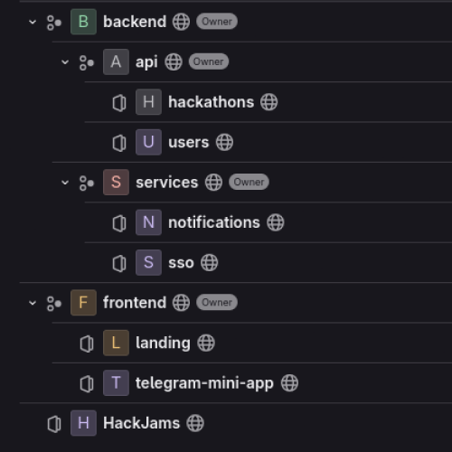
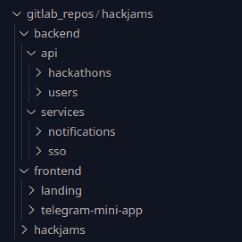

# GitLab Group Cloner

Этот скрипт на Go позволяет автоматически клонировать все репозитории из группы GitLab и её подгрупп в локальную файловую систему, сохраняя оригинальную иерархию подгрупп как каталоги.

## Функциональность

- **Клонирование через HTTPS**: Скрипт использует HTTPS для клонирования репозиториев.
- **Сохранение структуры**: Иерархия подгрупп из GitLab преобразуется в соответствующую структуру каталогов.
- **Автоматическое сканирование**: Скрипт рекурсивно собирает информацию обо всех репозиториях группы и её подгрупп.

## Пример структуры

### Исходная структура в GitLab

```
Group
├── Subgroup1
│   ├── Repo1
│   └── Repo2
└── Subgroup2
    └── Repo3
```

### Локальная структура после клонирования

```
cloneDir/
├── Group/
│   ├── Subgroup1/
│   │   ├── Repo1/
│   │   └── Repo2/
│   └── Subgroup2/
│       └── Repo3/
```

## Установка

1. Убедитесь, что у вас установлен Go версии 1.16 или выше.
2. Клонируйте этот репозиторий:
   ```bash
   git clone https://your-repository-url.git
   ```
3. Установите зависимости:
   ```bash
   go mod tidy
   ```

## Конфигурация

Создайте файл `config.yaml` в корневой директории с таким содержимым:

```yaml
gitlab_url: "https://gitlab.example.com"
group_id: "123456" # ID группы
token: "your-private-token" # Личный токен доступа
clone_dir: "./repositories" # Директория для клонирования
per_page: 50 # Количество элементов на страницу
```

## Запуск

Выполните следующую команду для запуска скрипта:

```bash
go run main.go --config=config.yaml
```

Или скачайте бинайрный файл и запустите его

```bash
./clone-group-gitlab --config=config.yaml
```

## Пример результата

### Скриншоты

На изображении слева представлена структура групп и подгрупп в GitLab, а справа — соответствующая локальная структура каталогов.

<p align="center">
  
    
</p>

## Примечания

1. Убедитесь, что токен доступа имеет достаточно прав для чтения репозиториев и подгрупп.
2. Для работы скрипта требуется установленный Git.

